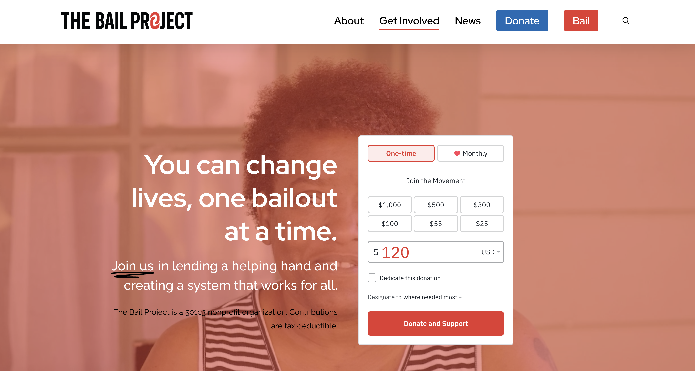
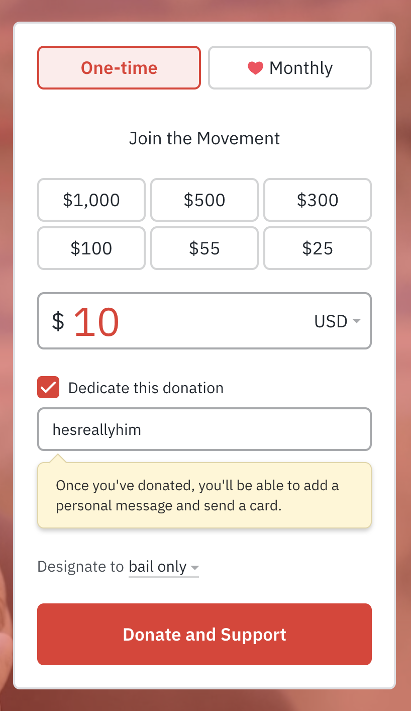
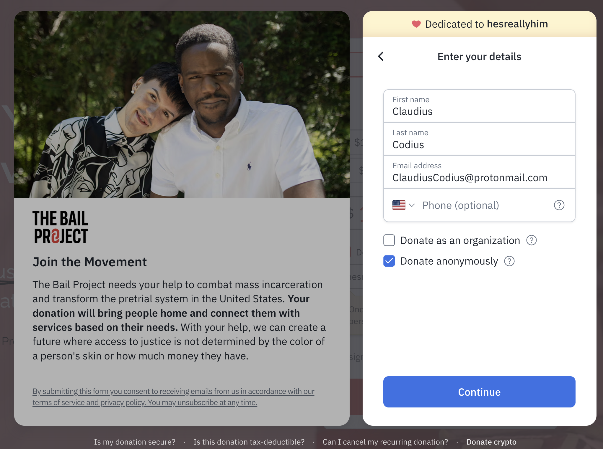
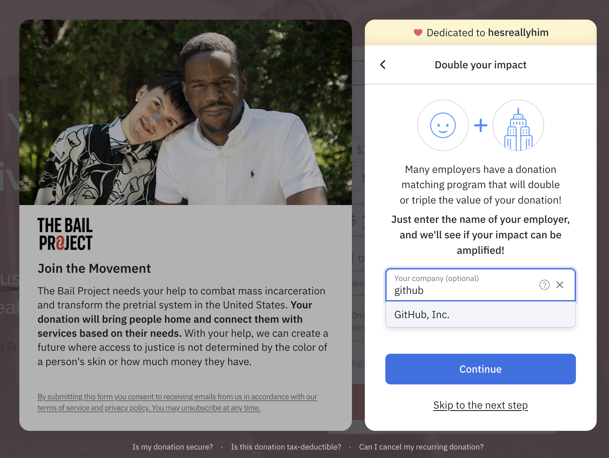
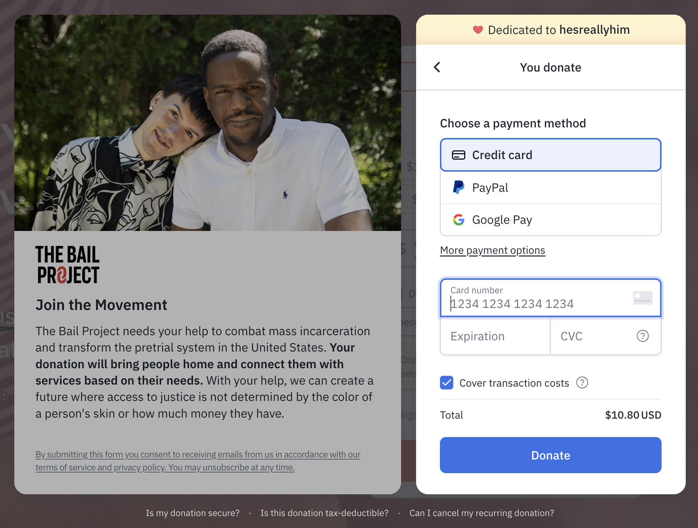
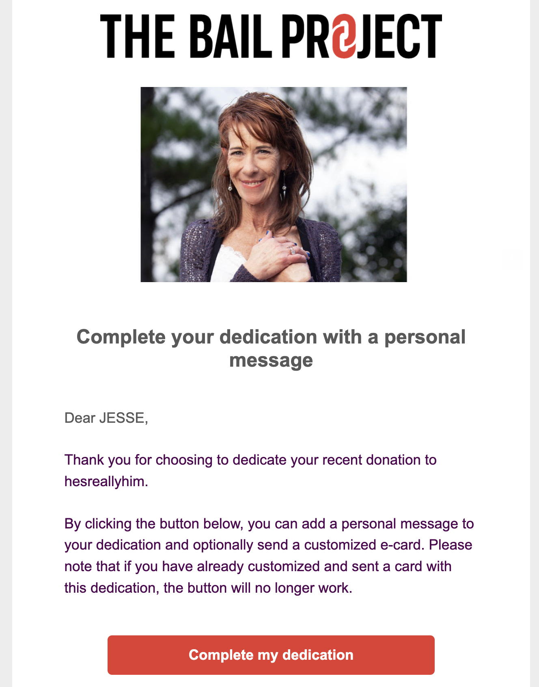
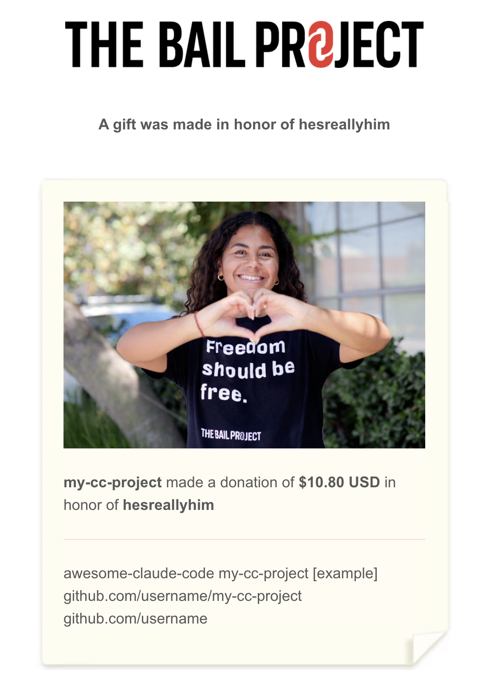

# Donations

Maintaining this repository consumes a non-trivial amount of my time, energy, and financial resources. But it doesn't seem right to me to accept contributions or sponsors for a repository that mainly features other people's work. Instead, I've decided to direct anyone who wishes to support this repo financially to make a direct financial contribution to a non-profit that I support - if I'm able to raise money in this way, then I'll have additional motivation to continue to devote myself to maintaining this repo with the care and attention that it deserves. _This is for reals._ This provides a tangible incentive and will help to promote the quality of the repository - not to mention that you will be helping real people in a way that's not just about software.

The project I've chosen to support is [The Bail Project](https://bailproject.org/), which provides direct financial relief for cash bail so that people who are presumed innocent are not detained while awaiting a court date. Visit their website for much more information about cash bail and how they operate.

If you wish to support this repo by donating to the The Bail Project, you may do so in the following way:

### 1: Go to the Donate Page
Go to https://bailproject.org/ and click [DONATE](https://bailproject.org/donate/) (or just scroll down to the Donate widget).

### 2: Enter Donation Amount
- Enter whatever amount you want to donate (individual amounts will not be published on the repo, although I will be notified if you elect to dedicate your donation to me, and I would like to keep track of total funds raised).
- Select "One-time" or "Monthly".
- Check "Dedicate this donation" and enter "hesreallyhim" (if you want to be listed as a donor).
- Designate to "bail only" (optional).
- Click "Donate and Support"

### 3: Enter Your Name

- Enter your details (use your real name because this will be for your CC/PayPal/etc. info). Your personal details will not be published on this repo, nor will they be sent to me, unless you choose to do so in the dedication part.
- Donate anonymously if you want. (optional) ("Anonymously" with respect to The Bail Project, that is.)
- Click "Continue".

### 4: See if Your Employer Will Match

- See if your employer is registered with this program (it looks like GitHub is!).
- Click Continue or "skip to the next step".

### 5: Enter Payment Details

- Enter your payment details (CC, PayPal, Google Pay, Venmo, Bank, or BTC).
- Select "Cover transaction costs" to pay for the platform fee. (minimal fee - optional)
- Click "Donate"

### 6: Look for the Dedication Email

(Don't worry, you're almost 10% of the way there)

- If you followed the instructions above, you will receive an email from The Bail Project saying: "Complete your dedication with a personal message".
- Click the link "Complete my dedication".

### 7: Complete the Dedication

- Fill out the information for the dedication email ("in honor of" hesreallyhim). Here, I think you can use whatever name/alias you want - but be sure to include the name of your resource/repo if you want to be listed as an awesome donor. (If you are contributing but are not featured on the list, feel free to put your name, or even remain anonymous, if you wish.) And please tick "Show the amount of my gift" so that I can keep track of how much we've raised in total.
- At the bottom, enter my recipient information:
    - First Name: "Really"
    - Last Name: "Him"
    - Email: "hesreallyhim@proton.me"
- Click "Send email"

Done!!! 🎉

I will then receive an email that looks like this:

### **FINALLY**

I will add your project's name (or your name, as so desired) to the list of donors and your list entry will get an awesome "FREEDOM FUNDER" badge:

It's really as simple as that. 🙃

This is a kind of experiment, because GitHub does not offer an official way to direct sponsors towards a charitable project unrelated to open-source software (understandable), so we'll see how this goes. If you do not support the social project that I've chosen to support, that's OK too, but please be respectful, as is already required by the Code of Conduct, or just donate anyway - after all, who knows what people do with their "Buy me a coffee" money? 😜
